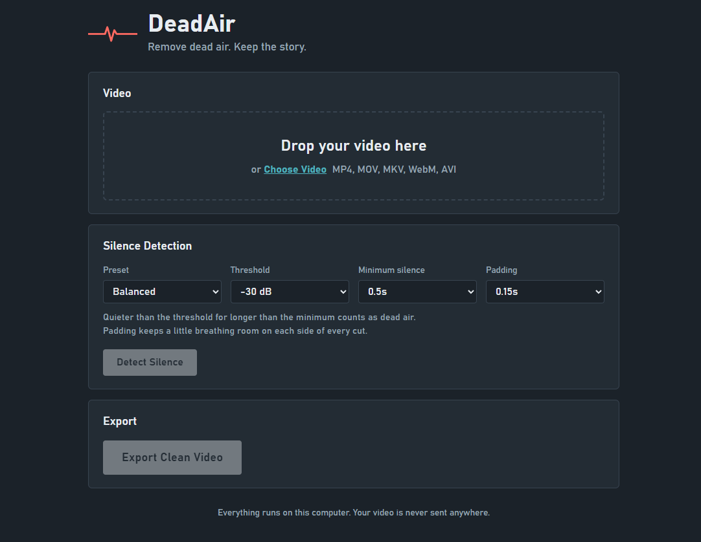

# DeadAir

**Remove dead air. Keep the story.**

Automatically remove dead air from talking-head, UGC, VSL, podcast, and interview videos.



## What is DeadAir?

DeadAir detects silent sections in speech-heavy videos and removes those sections from the timeline.

Drop in a video, detect the silence, review the timeline, and export a clean, tighter version.

**It doesn't mute silence. It actually cuts it out.**

DeadAir is a local utility built around FFmpeg. There is no cloud processing, API key, account, subscription, or paid service.

## Why?

Editors spend a lot of time manually scrubbing through footage looking for pauses and dead air.

DeadAir automates that repetitive part so you can spend more time on the actual edit.

## Features

* Automatic silence detection using FFmpeg
* Visual timeline showing kept and removed sections
* Configurable silence threshold
* Configurable minimum silence duration
* Adjustable cut padding
* Natural, Balanced, and Aggressive presets
* Actual timeline removal instead of muting
* Audio and video synchronization preserved
* Real FFmpeg progress reporting
* MP4, MOV, MKV, WebM, and AVI support
* Local processing
* No API key
* No cloud upload
* No subscription
* No database
* Zero Python dependencies

## Quick Start

### Requirements

* Windows
* Python 3.10+
* FFmpeg

### Run

1. Download or clone this repository.
2. Make sure Python and FFmpeg are installed.
3. Double-click `run.bat`.
4. DeadAir opens in your browser.
5. Drop in a video.
6. Click **Detect Silence**.
7. Review the detected sections.
8. Click **Export Clean Video**.

Exports are saved in:

```text
DeadAir/output/
```

The exported file uses the original filename with `_deadair` added.

For example:

```text
my-video.mp4
→
my-video_deadair.mp4
```

Existing files are never overwritten.

## Settings

| Setting           | Options                          | Default | Description                                                          |
| ----------------- | -------------------------------- | ------- | -------------------------------------------------------------------- |
| Silence threshold | -20, -25, -30, -35, -40 dB       | -30 dB  | Determines how quiet audio must be before it counts as silence.      |
| Minimum silence   | 0.3, 0.5, 0.7, 1, 1.5, 2 seconds | 0.5 s   | Shorter pauses are ignored.                                          |
| Padding           | 0, 0.1, 0.15, 0.25, 0.5 seconds  | 0.15 s  | Keeps a small amount of silence around cuts for more natural pacing. |

### Presets

| Preset     | Threshold | Min silence | Padding |
| ---------- | --------: | ----------: | ------: |
| Natural    |    -35 dB |       0.7 s |  0.25 s |
| Balanced   |    -30 dB |       0.5 s |  0.15 s |
| Aggressive |    -25 dB |       0.3 s |  0.10 s |

**Balanced** is the default.

## How it works

DeadAir uses FFmpeg's `silencedetect` filter to analyse the video's real audio.

It identifies silence intervals, applies padding, calculates the sections that should remain, and then creates a new video from those sections.

Example:

```text
Original:

speech 0-5
silence 5-7
speech 7-12
silence 12-13.5
speech 13.5-20

↓

Output:

0-5
7-12
13.5-20
```

The silence is removed from the actual timeline rather than simply being muted.

### Export

Accurate cuts require re-encoding, so DeadAir uses FFmpeg to rebuild the video from the kept segments.

Video and audio are trimmed together and concatenated while preserving synchronization.

Output:

* MP4
* H.264
* AAC 192 kb/s
* Same resolution
* Same aspect ratio
* Same frame rate

If no silence is detected, DeadAir does not re-encode the video.

If the entire video is silent, DeadAir refuses to export rather than creating a broken file.

## Privacy

DeadAir processes videos locally.

Your video is not uploaded to a remote server. The browser communicates only with the DeadAir server running on your own computer.

A temporary copy of the uploaded video is created while processing and removed when you load another video or quit the application.

## Project Structure

```text
deadair/
├── DeadAir/
│   ├── app/
│   │   ├── main.py
│   │   ├── silence.py
│   │   ├── video.py
│   │   ├── utils.py
│   │   ├── templates/
│   │   └── static/
│   ├── tests/
│   ├── requirements.txt
│   └── run.bat
├── assets/
│   └── deadair-ui.png
├── README.md
└── .gitignore
```

DeadAir deliberately uses Python's standard-library HTTP server instead of FastAPI. This keeps installation simple: **Python + FFmpeg**.

## Testing

DeadAir includes unit tests, FFmpeg integration tests, and API tests.

Run:

```bash
python -m unittest discover -s DeadAir/tests -v
```

The test suite generates synthetic videos with known silence ranges, tests detection and export, verifies output with FFprobe, and checks audio/video synchronization.

## Known Limitations

* Export requires re-encoding and therefore takes real processing time.
* Very long videos with hundreds of cuts can require more memory.
* Variable-frame-rate sources may have small sub-frame differences at cut points.
* The browser temporarily copies the input video, so free disk space roughly equal to the video size is recommended.
* Windows is the primary target platform.

## Roadmap

Potential future features:

* Manual include/exclude cuts
* Filler-word detection
* Automatic jump-cut editing
* Caption generation
* Custom editor presets
* Premiere / CapCut / DaVinci workflow integration

## License

MIT License.
